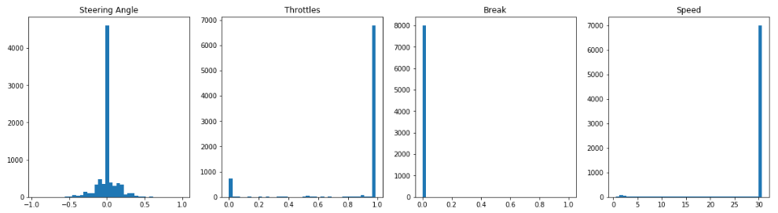
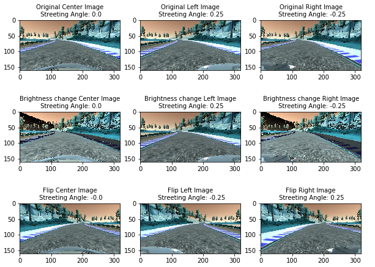
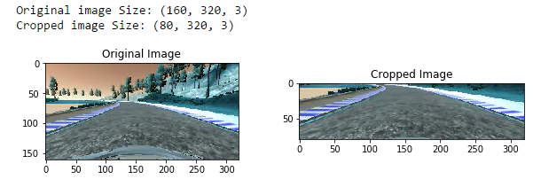
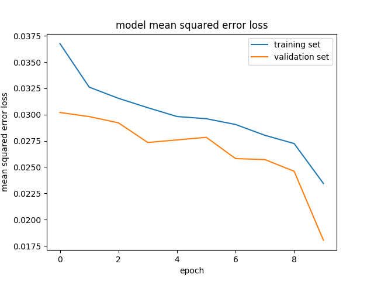

# CarND-Behavioral-Cloning-P3

## Behavioral Cloning Project

The goals / steps of this project are the following:

a) Use the simulator to collect data of good driving behavior

b) Build, a convolution neural network in Keras that predicts steering angles from images

c) Train and validate the model with a training and validation set
d) Test that the model successfully drives around track one without leaving the road
e) Summarize the results with a written report

# Files Submitted & Code Quality

**1. Submission includes all required files and can be used to run the simulator in autonomous mode. **

**Ans.** : My project includes the following files:

a) model.py : Containing the script to create and train the model. 

b) drive.py : For driving the car in autonomous mode. 

c) model.h5 : Containing a trained convolution neural network. File with training weights in h5 format.

d) writeup_report.md : Summarizing the results

e) video.mp4 : A video recording of Track 1 where car is able to drive autonomously one lap around the track successfully

**2. Submission includes functional code. **

**Ans.** : Using the Udacity provided simulator and my drive.py file, the car can be driven autonomously around the track by executing below command:

#**python drive.py model.h5**

I modified the drive.py to run the car at 20 mph speed (by default speed was set at 9 mph). Also if there are sharp turn, reduce the throttle to speed down.

** 3. Submission code is usable and readable. **

**Ans.** : The model.py file contains the code for training and saving the convolution neural network. The file shows the pipeline I used for training and validating the model, and it contains comments to explain how the code works. All functions are explained in details with Description , Input Parameter and Return Type.

# Training Strategy

** 1. Training Data : **

First I tried with data generated by me for Track 1. I record the data as below :

a) 3 lap of center lane driving 

b) 2 lap of driving in Counter-Clockwise. 

c) 1 lap of recovery driving from sides

My data consist of ~15000 images including center, left and right images . However i was not able to run full track with data. It always off the track at sharp turn (specially after bridge on track1). May be because i recorded data with keyboard  driving and that not able to record data appropriately.

And when I tried with Udacity provided data, my model perform well and car was able to drive in autonomous mode. So I decided to continue Udacity provided data to train the model and further experiment and fine tuning. 

As a improvement i will again try to record data myself not only on track1 but also on track2 and train and experiment.

Below is the Visualization of Udacity Data :



From the graph above, we can deduce following information:

a) Most of data recorded with full throttle

b) Most of the data recorded at full speed i.e. 30 mph

c) Most of the data recorded without any break.

d) Most of the images have steering agle is zero i.e. running straight with any curve.

Let’s use the data Augmentation technique to fine tune the data


** 2. Data Augmentation : **

First i trained the model using only center images without any agumentation. I reliazed that car is off the track during curvy surface. Then based on Udacity lesson explanation and previous data agumentation technique, I decided below methods   

**a) Picking images from all 3 camera images (center, left and right) **: For center images there is no correction required in steering angle. For left and right images, correction is required in steering angle to better represent the car data. I used correction value = 0.25 . I came to this value based on mutiple trial. In summary :

Center images : No change required in steering angle

Left Images : steering angle = steering angle + correction

right images : steering angle = steering anle - correction

** b) Briggtness ** : The training samples brightness are randomly changed so as to have training data that closely represent various lighting conditions like night, cloudy, evening, etc. 

** c) Image Flipping ** : Because Track1 contain most of trun to the left. In order to get more uniform dataset, I flipped the images (horizontal mirror ) and multiplied the steering angle by -1 to get a valid data. This was explained in Udacity lesson.

** d) Random data generation ** : I used random function to generate all types of data (No change , brightness change, flip change) in uniform order. By doing this, data size count increases to 3 times. 

Below is the visualization of randomly selected center, left and right images 




# Model Architecture

** 1. An appropriate model architecture has been employed ** :

**Ans. :** I Implemented 2 models using Keras library :

a) [Lenet](http://yann.lecun.com/exdb/publis/pdf/sermanet-ijcnn-11.pdf)

Advantages :  Easy to implement, less complex , less feature parameter and faster to tune.

Disadvantages : Didn't get enough accuracy. Was not able to run car for entire lab in autonomous mode. However I saw on forum discussion that others were able to run the car for entire lab with lenet also. May be i have to further fine tune the network.

b)  [Nvidia E2E Self Driving Model](https://arxiv.org/pdf/1604.07316v1.pdf)

Advantages : Was successfully able to run the car for entire lab for track 1 in autonomous mode.

Disadvantages : Complex , more feature parameter and need more time to train model compare to lenet  

The Nvidia model consists of 5 convolutions layer (first three convolutional layers with a 2x2 stride and a 5x5 kernel and a non-strided convolution with a 3x3 kernel size in the last two convolutional layers) And three fully connected layer and 1 ouput layer. Below is the model summary :
Nvidia Model summary : 

Layer (type)                     Output Shape          Param #     Connected to                     
====================================================================================================
cropping2d_1 (Cropping2D)        (None, 80, 320, 3)    0           cropping2d_input_1[0][0]         
____________________________________________________________________________________________________
lambda_1 (Lambda)                (None, 80, 320, 3)    0           cropping2d_1[0][0]               
____________________________________________________________________________________________________
convolution2d_1 (Convolution2D)  (None, 38, 158, 24)   1824        lambda_1[0][0]                   
____________________________________________________________________________________________________
convolution2d_2 (Convolution2D)  (None, 17, 77, 36)    21636       convolution2d_1[0][0]            
____________________________________________________________________________________________________
convolution2d_3 (Convolution2D)  (None, 7, 37, 48)     43248       convolution2d_2[0][0]            
____________________________________________________________________________________________________
convolution2d_4 (Convolution2D)  (None, 5, 35, 64)     27712       convolution2d_3[0][0]            
____________________________________________________________________________________________________
convolution2d_5 (Convolution2D)  (None, 3, 33, 64)     36928       convolution2d_4[0][0]            
____________________________________________________________________________________________________
flatten_1 (Flatten)              (None, 6336)          0           convolution2d_5[0][0]            
____________________________________________________________________________________________________
dense_1 (Dense)                  (None, 100)           633700      flatten_1[0][0]                  
____________________________________________________________________________________________________
dropout_1 (Dropout)              (None, 100)           0           dense_1[0][0]                    
____________________________________________________________________________________________________
activation_1 (Activation)        (None, 100)           0           dropout_1[0][0]                  
____________________________________________________________________________________________________
dense_2 (Dense)                  (None, 50)            5050        activation_1[0][0]               
____________________________________________________________________________________________________
dropout_2 (Dropout)              (None, 50)            0           dense_2[0][0]                    
____________________________________________________________________________________________________
activation_2 (Activation)        (None, 50)            0           dropout_2[0][0]                  
____________________________________________________________________________________________________
dense_3 (Dense)                  (None, 10)            510         activation_2[0][0]               
____________________________________________________________________________________________________
dropout_3 (Dropout)              (None, 10)            0           dense_3[0][0]                    
____________________________________________________________________________________________________
activation_3 (Activation)        (None, 10)            0           dropout_3[0][0]                  
____________________________________________________________________________________________________
dense_4 (Dense)                  (None, 1)             11          activation_3[0][0]               
____________________________________________________________________________________________________
activation_4 (Activation)        (None, 1)             0           dense_4[0][0]                    
====================================================================================================
Total params: 770,619
Trainable params: 770,619
Non-trainable params: 0


** 2. Attempts to reduce overfitting in the model ** :

** Ans. : **  In order to gauge how well the model was working, I split my image and steering angle data into a training and validation set. During the model training for no. of epochs i saw that mean squared error (MSE) loss for training and validation is fluctuating. This is sign of overfitting. I added **dropout layer** on FC layer. By this chain i can see my loss function are decreasing over no. of epochs and constant after some time. But fluctuating. 

Secondly, I added **'RelU' activation function** to introduce the non-linearity.  ReLU makes network training much faster without making significant differences to accuracy. Also it Improve the Parameter efficiency and allows network to solve more complex problem/patterns.

** 3. Model parameter tuning (Normalization , cropping , optimizer) ** :

** Ans. :**
a) **Normalization** : We used Keras lamdba layer to parallelize image normalization . Without using the lamdba normalization no the network was performing very badly.

b) **Cropping the image** : The cameras in the simulator capture 160x320x3 images. Not all pixels contain useful information. As see below image, the top portion of the image captures trees and hills and sky, and the bottom portion of the image captures the hood of the car. We cropped the image (60 pixels from above and 20 pixels from bottom) using Keras Cropping2D layer for image cropping within the model. The Cropping2D layer is useful for choosing an area of interest that excludes the sky and/or the hood of the car.
Below is the example : 


c) **Optimizer** : The model used an adam optimizer. The advantage of using adam optimizer, so that user don't need to tune manually the learning rate. 

d) ** Loss Function ** : Since it is a regression model, so we used Mean Square error (MSE) instead of softmax cross entropy function.

e) The model was trained over 10 epochs, with a batch size of 32.

f) ** Generator ** : I used generator function (Line 276 in model.py) to augment the data at run time with batch size of 32. 
Keras library is providing fit_generator() function (Line 508 in model.py). This allowed to generate random augment data to train my model. This approach (instead of using fit()) allows less memory space and increasing computing efficiency.

# Result 

After having a trained Nvidia model on random generated images using Udacity dataset. The Car is successfully able to run a complete lab in Track1 in autonomous mode. This result can be seen **Video.mp4**. 

Below is the Training and Validation Loss Graph Vs no. of epochs. As you can see loss is decreasing with # of epochs.



# Reflection And Improvement Suggestion
This was the most difficult project so far. I have learnt, how important is data collection and need bigger data set for complex network. Fine tuning the model took lots of time.  

**There are some general observations based on my experiment :**

a) Test results are unpredictable. The same model (model.h5) worked on my linux machine , but not work on windows and vice-versa.

b) Increasing the no. of epochs does not improve the results. In fact, car was going off the track. I experimented with different epochs value, finally able to create model which works on track1.

c) Lots of time spent in fine tuning the different parameters like : cropping image size , steering angle correction, no. of epochs to use , which model to train (lenet/Nvidia) , dataset size, etc...  

d) I also find model worked for a couple of laps, but don work after that. 

e) The model does not work if increase the speed more than 20 mph.


** Improvement suggestion :**

This project can be further improved. Below are the points I am planning to consider in future :

a) Test on Track 2 

b) Record better training data for both tracks 1 and 2. Probably my generated data was not perfect and created lots of noise.

c) Fine tune the Lenet model, so that car should work with both models.

d) Better data augmentation. Probably include other technique like shadows effect on images, vertical/horizontal shifting images, balanced dataset, etc..

e) Model should work till 30 mph speed. currently it works till 20 mph speed.

f) Model should be consistent. Currently it works for couple of laps, after that it goes off the track.

g) Error Handling of function. 


```python

```
